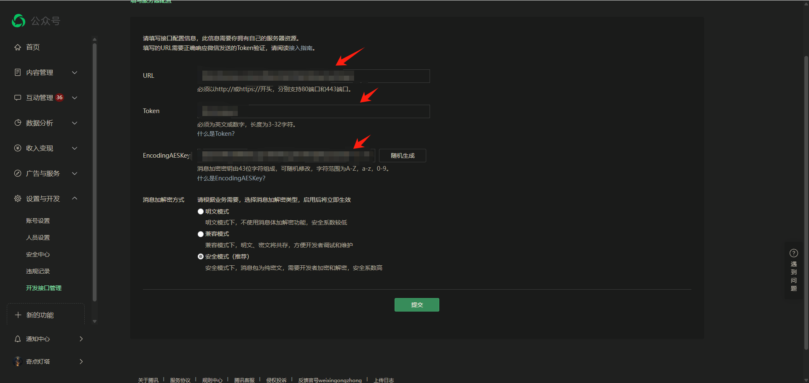

# Dify 微信公众号插件

⭐ **如果这个插件对您有帮助，请给个Star支持一下！** ⭐

**语言：** [English](README.md) | [中文](README_zh.md)

**作者：** bikeread  
**版本：** 0.0.7  
**类型：** 扩展插件  
**GitHub：** [代码仓库](https://github.com/bikeread/dify_wechat_plugin) | [问题反馈](https://github.com/bikeread/dify_wechat_plugin/issues)

## 📝 v0.0.5 版本更新

🎉 **v0.0.4 到 v0.0.5 主要更新内容：**

1. **🔧 插件安装修复** - 修复插件安装报错问题，确保安装过程顺利进行

### 历史更新 (v0.0.4)

**v0.0.3 到 v0.0.4 主要更新内容：**

1. **🌐 微信API代理支持** - 支持配置微信API代理地址，绕过微信白名单限制
2. **⏱️ 可配置重试超时** - 支持调整重试等待超时系数（默认0.7），优化响应时间控制
3. **🔥 交互式等待模式** - 未启用客服消息时，AI响应超时后用户可回复"1"延长等待时间，支持配置最大等待次数

---

> 🚀 **喜欢这个项目？** 在 GitHub 上给它一个 ⭐ 来表示支持！  
> 💡 **觉得有用？** 点个星标帮助更多人发现它！  
> 🎯 **想要更新通知？** 点击 Star 和 Watch 获取新功能推送！

## 概述

Dify 微信公众号插件专为内容创作者和公众号运营者设计，旨在将AI能力集成到微信公众号中。它提供24/7智能客服和内容辅助功能。

## 快速配置指南

### 步骤1：配置插件

1. 安装插件后，创建一个新的endpoint
2. 配置以下设置：

#### 必需设置
   - **Endpoint名称**：任意您喜欢的名称
   - **APP**：选择处理用户消息的Dify应用
   - **AppID**：您公众号的AppID
   - **微信Token**：从您的微信公众号平台复制

#### 加密模式设置（可选）
   - **EncodingAESKey**：从您的微信公众号平台复制（未配置则留空）
   - **AppSecret**：您公众号的AppSecret

#### 超时与响应设置（可选）
   - **超时消息**：当响应时间超过15秒时显示的消息（默认："内容生成耗时较长，请稍等..."）
   - **重试等待超时系数**：重试等待超时系数，范围0.1-1.0（默认：0.7）

#### 客服消息模式（可选）
   - **启用客服消息**：启用客服消息（需要客服消息权限，默认：false）

#### 交互式等待模式（可选，仅在未启用客服消息时生效）
   - **继续等待提示消息**：继续等待提示消息（默认："生成答复中，继续等待请回复1"）
   - **最大继续等待次数**：最大继续等待次数（默认：2）

#### 网络设置（可选）
   - **微信API代理地址**：自定义微信API代理地址（默认：api.weixin.qq.com，不要包含https://，不支持http）

> **注意**：超时消息很重要，因为微信要求在15秒内响应。如果您的AI应用生成完整响应需要更长时间：
> - 超时消息将作为即时响应发送
> - 如果配置了AppID和AppSecret，完整的AI响应将通过微信客服消息API发送
> - 请确保您的公众号有发送客服消息的权限

### 步骤2：配置微信公众号

1. 登录微信公众平台 (https://mp.weixin.qq.com/)
2. 进入"设置与开发" -> "基本配置"
3. 在"服务器配置"下：
   - 从插件配置中复制两个endpoint URL中的任意一个
   - 粘贴到"服务器地址(URL)"字段
   - 设置与插件中相同的Token
   - 选择消息加解密方式（明文模式或安全模式）
   - 如果使用安全模式，设置与插件中相同的EncodingAESKey
4. 点击"提交"保存配置



### 步骤3：验证配置

1. 保存插件和微信配置后
2. 向您的公众号发送测试消息
3. 如果收到AI响应，说明配置成功

> 🎉 **成功了！** 如果一切正常工作，请考虑给这个项目点个 ⭐ 帮助更多人发现它！

## 高级用法

### 支持的消息类型

此插件支持用户向您的微信公众号发送的多种消息类型：

#### 1. 文本消息
- 用户可以发送常规文本消息
- 相关输入参数：
  ```
  msgId: 唯一消息ID
  msgType: 消息类型 ("text")
  fromUser: 发送者的OpenID
  createTime: 消息创建时间戳
  content: 文本消息内容
  ```

#### 2. 图片消息
- 用户可以发送图片内容
- 系统向AI提供图片URL进行处理
- 相关输入参数：
  ```
  msgId: 唯一消息ID
  msgType: 消息类型 ("image")
  fromUser: 发送者的OpenID
  createTime: 消息创建时间戳
  picUrl: 用户发送的图片URL
  ```

#### 3. 语音消息
- 用户可以发送语音录音
- 系统将语音转换为base64格式供AI处理
- 相关输入参数：
  ```
  msgId: 唯一消息ID
  msgType: 消息类型 ("voice")
  fromUser: 发送者的OpenID
  createTime: 消息创建时间戳
  media_id: 微信语音媒体ID
  voice_base64: Base64编码的语音数据
  voice_media_type: 语音媒体类型
  voice_format: 语音格式（默认 "amr"）
  ```

#### 4. 链接消息
- 用户可以分享文章/网站链接
- 系统提取链接信息供AI处理
- 相关输入参数：
  ```
  msgId: 唯一消息ID
  msgType: 消息类型 ("link")
  fromUser: 发送者的OpenID
  createTime: 消息创建时间戳
  url: 分享的URL
  title: 分享链接的标题
  description: 分享链接的描述
  ```

您的Dify应用可以在对话上下文中访问所有这些参数并做出相应响应。

## 技术架构

此插件采用模块化设计，包含以下主要组件：

### 目录结构
```
endpoints/
├── wechat/                    # 核心微信处理模块
│   ├── __init__.py            # 包初始化
│   ├── models.py              # WechatMessage模型定义
│   ├── parsers.py             # XML解析器定义
│   ├── formatters.py          # 响应格式化器定义
│   ├── factory.py             # 消息处理器工厂
│   ├── crypto.py              # 微信消息加密工具
│   ├── retry_tracker.py       # 消息重试跟踪器
│   ├── api/                   # API相关
│   │   ├── __init__.py        # API包初始化
│   │   └── custom_message.py  # 客服消息发送器
│   └── handlers/              # 消息处理器
│       ├── __init__.py        # 处理器包初始化
│       ├── base.py            # 抽象处理器基类
│       ├── text.py            # 文本消息处理器
│       ├── image.py           # 图片消息处理器
│       ├── voice.py           # 语音消息处理器
│       ├── link.py            # 链接消息处理器
│       └── unsupported.py     # 不支持的消息类型处理器
├── wechat_get.py              # 处理微信服务器验证
└── wechat_post.py             # 处理用户消息
```

---

## 🌟 支持这个项目

如果您觉得这个插件有帮助，请考虑：

- ⭐ **给仓库点个星** 表示您的支持
- 🐛 **反馈问题** 帮助改进插件
- 💡 **建议功能** 参与未来开发
- 📢 **分享给其他人** 让更多人受益
- 🤝 **提交贡献** 发送 Pull Request

**您的支持是持续开发和改进的动力！**